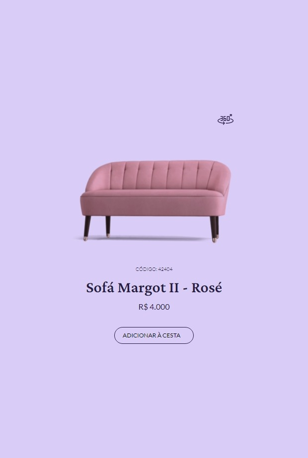

<h1>Teste Boracodar 2</h1>

>Simulação de uma página de venda de um produto

- Elaborada com ReactJS e TypeScript;

- Quando clicado o botão de "360°", a figura do produto começa a girar para o usuário visualizar o produto por inteiro.

 
 
